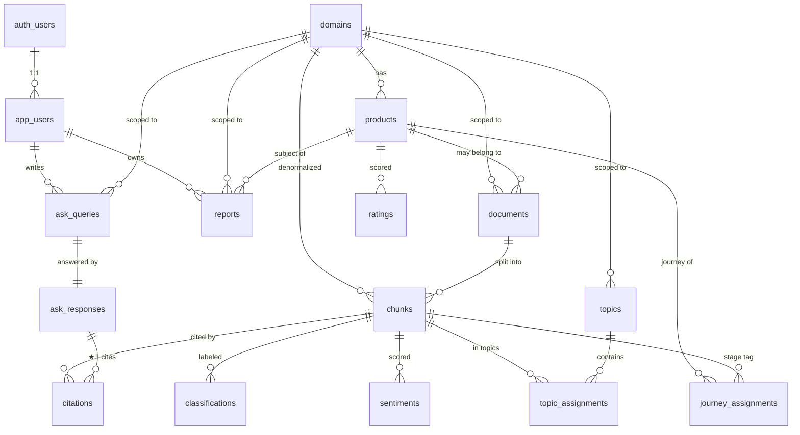

# DILAB 데이터베이스 스키마 / ERD v0.1

- **작성일 / AS_OF**: 2026-05-26
- **대상**: Supabase Postgres 16 + pgvector 0.7+
- **관련 문서**: [기술 스택 ADR](../research/tech-stack-decision.md) · [PRD B1~B6](../prd/dilab-mvp-prd.md)
- **설계 원칙**:
  1. **도메인-플렉시블 (★2)** — `domains` 가 hub. 모든 콘텐츠는 `domain_id` 로 분리. 도메인 추가 = `domains` 한 줄 + 코퍼스 업로드
  2. **출처 추적 (★1)** — `chunks` 의 source 가 모든 분석 결과 (점수·답변·리포트) 와 양방향 연결
  3. **상태 = Supabase, 연산 = Python 워커** — 모델 출력은 모두 *결과 테이블* 에 저장. 워커는 stateless
  4. **RLS 활용** — 사용자별·도메인별 가시성 제어. 가입 시 자동 생성되는 `app_users` 와 `domains.is_public` 으로 freemium·private 도메인 모두 커버

---

## 1. ERD 다이어그램 (Mermaid)



---

## 2. 테이블 정의 (15개)

### 2.1 Hub — 도메인·사용자

#### `domains` — **★2 핵심**
```sql
create table public.domains (
  id           uuid primary key default gen_random_uuid(),
  slug         text unique not null,                 -- 'cosmetics', 'fnb'
  name         text not null,                        -- '화장품', 'F&B'
  description  text,
  categories   jsonb not null default '[]'::jsonb,   -- B3 분류 카테고리: ['효능','성분','가격','사용감','안전성']
  rating_axes  jsonb not null default '[]'::jsonb,   -- 5축 평가 축 (위와 동일하거나 다를 수 있음)
  journey_stages jsonb not null default '[]'::jsonb, -- B4 여정 단계: [{key:'aware', label:'처음 알게 됐을 때'}, ...]
  sources_config jsonb not null default '{}'::jsonb, -- 데이터 소스 URL/패턴/필터
  is_public    boolean not null default true,        -- false 면 RLS 로 owner 만 접근
  owner_id     uuid references public.app_users(id),
  created_at   timestamptz not null default now(),
  updated_at   timestamptz not null default now()
);
```
> **`categories`·`rating_axes`·`journey_stages` 가 jsonb 인 이유**: 도메인마다 *개수와 명칭이 다름*. 화장품은 5축이지만 F&B 는 4축일 수도. 스키마 변경 없이 도메인 추가 가능.

#### `app_users` — Supabase auth.users 확장
```sql
create table public.app_users (
  id          uuid primary key references auth.users(id) on delete cascade,
  display_name text,
  role        text not null default 'user',          -- 'user' | 'admin' | 'expert'
  free_quota_used int not null default 0,            -- freemium 사용량 (월 N건)
  created_at  timestamptz not null default now()
);
```

---

### 2.2 콘텐츠 — 제품·문서·청크

#### `products`
```sql
create table public.products (
  id         uuid primary key default gen_random_uuid(),
  domain_id  uuid not null references public.domains(id) on delete cascade,
  name       text not null,
  brand      text,
  category   text,                                   -- 도메인 내 세부 카테고리 (스킨케어/클렌저 등)
  metadata   jsonb not null default '{}'::jsonb,     -- 가격대, 용량, 출시일 등
  created_at timestamptz not null default now()
);
create index idx_products_domain on public.products(domain_id);
```

#### `documents` — 전문가 리뷰 + 공개 리뷰 원본
```sql
create table public.documents (
  id              uuid primary key default gen_random_uuid(),
  domain_id       uuid not null references public.domains(id) on delete cascade,
  product_id      uuid references public.products(id) on delete set null,  -- null = 도메인 일반 자료
  source_type     text not null,                     -- 'expert' | 'public_review' | 'app_review' | 'aihub' | 'social'
  source_url      text,
  author          text,                              -- '가상 전문가 A' 등
  author_credibility int,                            -- 1-10 (전문가만)
  title           text,
  body            text not null,
  language        text default 'ko',
  published_date  date,
  collected_at    timestamptz not null default now(),
  seed_data       boolean not null default false,    -- synthetic 표시
  metadata        jsonb not null default '{}'::jsonb
);
create index idx_documents_domain_type on public.documents(domain_id, source_type);
create index idx_documents_product on public.documents(product_id) where product_id is not null;
```

#### `chunks` — **B1 벡터 인덱스 단위**
```sql
create extension if not exists vector;

create table public.chunks (
  id           uuid primary key default gen_random_uuid(),
  document_id  uuid not null references public.documents(id) on delete cascade,
  domain_id    uuid not null references public.domains(id) on delete cascade,  -- denormalized for fast filter
  chunk_index  int not null,
  text         text not null,
  token_count  int,
  embedding    vector(1024),                         -- BGE-M3 dim
  created_at   timestamptz not null default now(),
  unique (document_id, chunk_index)
);

-- HNSW 인덱스 (Supabase pgvector 0.7+)
create index idx_chunks_embedding_hnsw on public.chunks
  using hnsw (embedding vector_cosine_ops)
  with (m = 16, ef_construction = 64);

create index idx_chunks_domain on public.chunks(domain_id);
```
> **denormalized `domain_id`**: 벡터 검색 시 `where domain_id = ?` 필터를 빠르게 적용. 도메인-플렉시블 핵심.

---

### 2.3 분석 결과 — B2·B3·B4

#### `topics` — **B2 BERTopic 결과**
```sql
create table public.topics (
  id          uuid primary key default gen_random_uuid(),
  domain_id   uuid not null references public.domains(id) on delete cascade,
  topic_index int not null,                           -- BERTopic 의 -1, 0, 1, ... (-1 = outlier)
  label       text,                                   -- 사람 또는 LLM 부여
  keywords    text[] not null default '{}',
  coord_x     float,                                  -- 2D 클러스터 맵용
  coord_y     float,
  doc_count   int,
  representative_chunk_id uuid references public.chunks(id),
  generated_at timestamptz not null default now(),
  unique (domain_id, topic_index)
);
```

#### `topic_assignments` — chunk ↔ topic
```sql
create table public.topic_assignments (
  chunk_id    uuid not null references public.chunks(id) on delete cascade,
  topic_id    uuid not null references public.topics(id) on delete cascade,
  probability float,
  primary key (chunk_id, topic_id)
);
```

#### `classifications` — **B3 카테고리 분류**
```sql
create table public.classifications (
  id          uuid primary key default gen_random_uuid(),
  chunk_id    uuid not null references public.chunks(id) on delete cascade,
  category    text not null,                          -- '효능' | '성분' | ...
  confidence  float,
  assigned_by text,                                   -- 'claude-haiku-4-5' 등 모델명
  assigned_at timestamptz not null default now()
);
create index idx_classifications_chunk on public.classifications(chunk_id);
```

#### `sentiments` — **B3 감성**
```sql
create table public.sentiments (
  id          uuid primary key default gen_random_uuid(),
  chunk_id    uuid not null references public.chunks(id) on delete cascade unique,
  sentiment   text not null check (sentiment in ('positive','neutral','negative')),
  intensity   float check (intensity between 0 and 1),
  reason_topic_id uuid references public.topics(id), -- 부정/긍정 *왜* — 토픽 연결
  assigned_by text,
  assigned_at timestamptz not null default now()
);
```

#### `journey_assignments` — **B4 여정 단계 매핑**
```sql
create table public.journey_assignments (
  id          uuid primary key default gen_random_uuid(),
  chunk_id    uuid not null references public.chunks(id) on delete cascade,
  product_id  uuid not null references public.products(id) on delete cascade,
  stage_key   text not null,                          -- domain.journey_stages 의 key ('aware','consider','use','rebuy')
  confidence  float,
  is_estimated boolean not null default true,        -- reality check — 항상 추정임을 명시
  assigned_by text,
  assigned_at timestamptz not null default now(),
  unique (chunk_id, product_id, stage_key)
);
create index idx_journey_product on public.journey_assignments(product_id, stage_key);
```
> **`is_estimated`**: PRD reality check 반영. UI 에서 "추정" 라벨 노출 강제.

#### `ratings` — **5축 평가 점수 (제품 단위)**
```sql
create table public.ratings (
  id          uuid primary key default gen_random_uuid(),
  product_id  uuid not null references public.products(id) on delete cascade,
  axis        text not null,                          -- '효능' | '성분' | ...
  score       numeric(3,1) check (score between 0 and 10),
  evidence_chunk_ids uuid[] not null default '{}',   -- ★1 — 이 점수의 근거 청크
  generated_by text,
  generated_at timestamptz not null default now(),
  unique (product_id, axis, generated_at)
);
create index idx_ratings_product on public.ratings(product_id);
```
> **`evidence_chunk_ids`**: 5축 hover 인용에 직접 사용. 단순히 점수만 매기는 게 아니라 *근거 청크 ID 함께 저장* — Reality check 의 "5축 hover 인용" 가능성을 데이터 모델 단에서 강제.

---

### 2.4 Q&A — B5 DILAB Ask

#### `ask_queries`
```sql
create table public.ask_queries (
  id         uuid primary key default gen_random_uuid(),
  user_id    uuid not null references public.app_users(id),
  domain_id  uuid not null references public.domains(id),
  product_id uuid references public.products(id),    -- null = 도메인 일반 질문
  query      text not null,
  created_at timestamptz not null default now()
);
```

#### `ask_responses` — LLM 답변 + 메타
```sql
create table public.ask_responses (
  id           uuid primary key default gen_random_uuid(),
  query_id     uuid not null references public.ask_queries(id) on delete cascade unique,
  answer       text not null,
  recommendation text,                                -- B5 추천 한 줄
  llm_model    text,                                  -- 'claude-haiku-4-5' 등
  latency_ms   int,
  token_in     int,
  token_out    int,
  created_at   timestamptz not null default now()
);
```

#### `citations` — **★1 출처 카드**
```sql
create table public.citations (
  response_id uuid not null references public.ask_responses(id) on delete cascade,
  chunk_id    uuid not null references public.chunks(id) on delete cascade,
  cite_type   text not null check (cite_type in ('expert','public')),
  rank        int,                                    -- 1, 2, 3, ... 답변 내 인용 순서
  primary key (response_id, chunk_id)
);
create index idx_citations_chunk on public.citations(chunk_id);  -- "이 청크가 몇 번 인용됐나" 역추적
```

---

### 2.5 산출물 — B6 리포트

#### `reports`
```sql
create table public.reports (
  id           uuid primary key default gen_random_uuid(),
  user_id      uuid references public.app_users(id),
  domain_id    uuid not null references public.domains(id),
  product_id   uuid not null references public.products(id),
  report_type  text not null default 'single_product',
  data_snapshot jsonb not null,                       -- 생성 시점의 ratings·topics·sentiments·journey·citations 묶음
  pdf_url      text,                                  -- Supabase Storage 경로
  created_at   timestamptz not null default now()
);
create index idx_reports_user_product on public.reports(user_id, product_id);
```
> **`data_snapshot`**: 리포트를 *과거 시점 데이터로* 재현 가능. 코퍼스가 갱신돼도 옛 리포트는 옛 값 유지.

---

## 3. RLS 정책 (요약, advisor 적용)

> ⚠️ Supabase Postgres Linter 권고: `auth.uid()` 호출은 **반드시 `(select auth.uid())` 로 감싼다** — 행 단위 재평가 회피, 대용량에서 성능 차 큼.

```sql
-- 도메인: 공개 도메인은 모두 read, private 은 owner 만
create policy domains_read on public.domains
  for select using (is_public or owner_id = (select auth.uid()));

-- 사용자 데이터: 본인만
create policy ask_queries_own on public.ask_queries
  for all using (user_id = (select auth.uid())) with check (user_id = (select auth.uid()));

create policy reports_own on public.reports
  for all using (user_id = (select auth.uid())) with check (user_id = (select auth.uid()));

-- 분석 결과: 도메인이 public 이거나 owner 면 read
create policy chunks_read on public.chunks
  for select using (exists (
    select 1 from public.domains d
    where d.id = chunks.domain_id and (d.is_public or d.owner_id = (select auth.uid()))
  ));
-- (topics, classifications, sentiments, ratings, journey_assignments 도 동일 패턴)

-- 쓰기는 service_role (Python 워커) 만
-- → anon/authenticated 에는 write 정책 부여 X. Edge Function 또는 service_role JWT 로만.
```

### 3.1 SECURITY DEFINER 함수의 RPC 노출 회피

`handle_new_user()` 같은 트리거 전용 함수는 RPC (`/rest/v1/rpc/...`) 로 노출되면 보안 lint 가 뜬다. 트리거 등록 *직후* 권한 회수:

```sql
revoke execute on function public.handle_new_user() from public, anon, authenticated;
```

---

## 4. 핵심 쿼리 예시 (★1 출처 추적)

```sql
-- 답변에 인용된 청크 + 출처 타입 + 원본 문서 메타
select
  c.id          as chunk_id,
  c.text,
  d.author,
  d.author_credibility,
  d.source_type,
  cit.cite_type,
  cit.rank
from citations cit
  join chunks c    on c.id = cit.chunk_id
  join documents d on d.id = c.document_id
where cit.response_id = $1
order by cit.rank;
```

```sql
-- 5축 평가 + 각 축 근거 청크 (★1 hover 용)
select
  r.axis, r.score,
  array_agg(c.text order by c.created_at desc) filter (where c.id = any(r.evidence_chunk_ids))
    as evidence_texts
from ratings r
  left join chunks c on c.id = any(r.evidence_chunk_ids)
where r.product_id = $1
group by r.id, r.axis, r.score
order by r.axis;
```

```sql
-- 벡터 검색 — 도메인 필터 + 전문가 우선
select
  c.id, c.text, d.source_type, d.author, d.author_credibility,
  1 - (c.embedding <=> $1::vector) as similarity
from chunks c
  join documents d on d.id = c.document_id
where c.domain_id = $2
  and d.source_type in ('expert','public_review')
order by
  case d.source_type when 'expert' then 0 else 1 end,  -- 전문가 우선
  c.embedding <=> $1::vector                            -- 그 다음 유사도
limit 10;
```

---

## 5. 마이그레이션 순서 (M1)

```
01_extensions.sql          -- create extension vector
02_app_users.sql
03_domains.sql
04_products.sql
05_documents.sql
06_chunks.sql              -- vector(1024) + HNSW
07_topics_and_assignments.sql
08_classifications.sql
09_sentiments.sql
10_journey.sql
11_ratings.sql             -- ★1 evidence_chunk_ids
12_ask_queries_responses.sql
13_citations.sql           -- ★1
14_reports.sql
15_rls.sql
16_seed_cosmetics.sql      -- 도메인 1개 + sample 데이터
```

---

## 6. 향후 확장 (P1 이후)

- `experts` 별도 테이블 (현재는 `documents.author` 텍스트) — 전문가 영입 단계에 정규화
- `workflow_runs` — 자동화 워크플로 로그 (P1 B4 차용-2)
- `subscriptions` — Pro 티어 결제
- `audit_log` — 변경 이력

---

## 7. 변경 이력

| 버전 | 날짜 | 변경 |
|---|---|---|
| v0.1 | 2026-05-26 | 초안. 15개 테이블, pgvector + RLS. ★1·★2 데이터 모델 단에서 강제. Reality check 반영 (`is_estimated`, `evidence_chunk_ids`). |
| v0.2 | 2026-05-26 | **Supabase 원격 적용 + advisor 권고 반영**. (a) 모든 RLS 정책 `auth.uid()` → `(select auth.uid())`. (b) `handle_new_user` RPC 차단. (c) FK 인덱스 9개 추가 (ask_queries / domains / reports / sentiments / topic_assignments / topics). 마이그레이션: `dilab_initial_setup` + `dilab_advisor_fixes`. |
